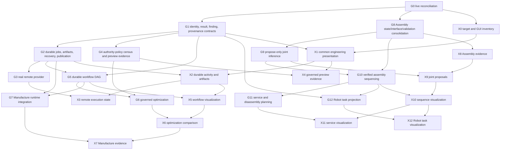

# VibeCAD governed engineering roadmap

**Roadmap status:** active and canonical for the cross-domain governed
engineering extension

**Audited baseline:**
`93500486c1515eac2ee98121e16a96a3038c0299` on 2026-08-26

## 1. Purpose

This roadmap turns the Governed Engineering Architecture whitepaper into an
implementation plan tied to the current VibeCAD source tree. It preserves the
paper's central direction while correcting status inflation, avoiding duplicate
domain owners, and adding the persistence, security, migration, recovery, and
acceptance requirements needed for real delivery.

The target product is a governed parametric engineering host in which:

- AI proposes, explains, compares, and steers engineering work;
- Native and VibeScript own interactive CAD mutation;
- Analysis owns detached computation lifecycle, not domain physics;
- domain adapters own physics, manufacturing, assembly, and robot semantics;
- exact source identity, sealed inputs, currentness, verification, provenance,
  and publication authority remain machine-checkable;
- human-selected authority and approval policies remain explicit;
- every completion claim names the evidence and the boundary it proves.

This roadmap does not claim that a model, mechanism, process plan, solver
result, manufactured part, robot path, or product is safe for real-world use.

## 2. Source-of-truth order

Use this precedence when implementation and documents disagree:

1. Current executable source, build registration, tests, and validated runtime
   behavior determine what exists.
2. This roadmap determines the cross-domain sequence, status, dependencies,
   and closure gates.
3. Domain roadmaps and specifications determine domain semantics and acceptance
   details. In particular:
   - [VibeCADAero canonical roadmap](vibecadaero-roadmap.md) owns Aero physics,
     solver integration, qualification, and the original host persistence and
     publication milestones;
   - [Assembly and Mechanism Integration](assembly-mechanism-integration-spec.md)
     owns the authoritative Assembly graph, mechanism evaluation, and Part
     Design verification facade;
   - [Bundled Standard Fasteners](standard-fasteners-integration-spec.md) owns
     standard-component packaging, catalogs, and supported fastener geometry.
4. The
   [whitepaper evaluation](vibecad-governed-engineering-whitepaper-evaluation.md)
   explains why the submitted proposal was accepted, bounded, reframed, or
   rejected as duplicate.
5. The submitted whitepaper is strategic input, not implementation evidence.

If current source contradicts a roadmap status, the source wins and the
roadmap must be corrected in the same pull request that relies on the newly
discovered state. Do not rewrite an old audit baseline to attribute later work
to an earlier revision.

## 3. Status vocabulary

| Status | Meaning |
| --- | --- |
| **Verified complete for the stated slice** | The bounded milestone has source, tests, packaging, and stated acceptance evidence. It makes no claim about later milestones. |
| **Partial** | A real foundation or product slice exists, but one or more named closure gates remain. |
| **Design-ready** | Owners, dependencies, compatibility boundaries, and acceptance gates are defined; production implementation has not closed them. |
| **Blocked by prerequisite** | Work must not become a production path until a named earlier gate closes. |
| **Unverified** | Current evidence is insufficient or contradictory. |

An interface, schema, mock provider, preview, queued job, solver exit code,
plausible output, screenshot, generated report, focused unit test, or design
document does not by itself complete a milestone.

## 4. Non-negotiable architecture locks

### 4.1 Existing owners remain authoritative

| State or capability | Authoritative owner | Other layers may do |
| --- | --- | --- |
| Parametric CAD state and accepted mutation | Native FreeCAD/VibeCAD and the selected Native or VibeScript authoring path | Propose, preview, validate, and request mutation through the owner |
| Structural revision, call ticket, Native receipt, preview lifecycle | Native host state and dispatcher | Reference exact identities and policy; never bypass or clone them |
| Detached job lifecycle, artifacts, provider attempts, recovery | Analysis host runtime | Submit prepared domain work and consume bounded results |
| Physics/model choice, units, solver input/output meaning, qualification | Domain adapter and domain roadmap | Provider executes an explicit prepared specification |
| Assembly occurrences, connectors, joints, solved placements, kinematic state | Native Assembly and its shared mechanism-evaluation layer | Propose candidates and consume validated graph/evidence |
| Manufacturing Job, CAM operations, tools, post-processing, simulation | Native Manufacture/CAM domain | Run suitable detached tasks and attach evidence to exact domain state |
| Robot setup, kinematics, trajectory, simulation, and export | Native Robot domain | Receive verified task intent and perform downstream domain validation |
| Engineering Experience shell, cards, charts, and overlays | Presentation layer consuming exact G/domain contracts | Render governed state and request owning actions; never infer, mutate, execute, verify, publish, or export |
| Human approval and authoring mode | Human-selected VibeCAD authority state | Report requirements and wait for the owning authority |

No milestone may create a second canonical Assembly graph, manufacturing Job,
Robot trajectory stack, preview controller, publication coordinator, solver
physics selector, or provider-specific CAD mutation API.

The visual north star is a quality and information-architecture target, not
engineering evidence. Scientific field color and governance/status color are
independent systems. No screenshot, card, chart, thumbnail, progress indicator,
or badge may invent a value or strengthen the source claim. The cross-cutting
[Engineering Experience X-track](design/engineering-experience/ENGINEERING_EXPERIENCE_X_TRACK.md)
is a presentation projection of G0-G12, not a parallel owner or roadmap.

### 4.2 Identities are distinct and non-substitutable

The following identities must be explicit where applicable:

- project and source document UID;
- structural revision and dependency snapshot digest;
- Native call ticket, preview ID, idempotency token, and receipt ID;
- durable analysis ID;
- host execution-attempt ID;
- provider job ID;
- lifecycle event source and event ID;
- trace ID and span ID;
- immutable result ID;
- publication receipt ID;
- workflow definition ID, workflow run ID, and node-run ID;
- assembly occurrence, component interface, joint, step, and task IDs.

A provider job ID is not an analysis ID. A trace ID is not durable job
identity. A source path or label is not document identity. A hash proves bytes,
not engineering meaning or publication authority.

### 4.3 Authority is narrower than capability

- Read, view, immediate mutation, preview-required mutation,
  confirmation-required mutation, export, external side effect, and privileged
  utility execution are separate policy classes.
- A preview never becomes accepted engineering state without a fresh apply
  gate owned by the authoritative mutation path.
- A successful provider attempt never publishes by itself.
- A worker or provider never receives a live FreeCAD document handle, GUI
  object, credential object, or document-thread mutation callback.
- Retry, reconnect, callback, restart, and duplicate events never authorize a
  second publication.
- The `/v1/run` compatibility route is a privileged local Python escape hatch,
  not evidence that all external CAD mutation is governed. Its retention,
  confinement, or deprecation requires a separately approved compatibility
  decision.

### 4.4 Persistence separates metadata from immutable artifacts

Durable metadata records identity, lifecycle, references, state transitions,
currentness decisions, and publication receipts. Immutable artifact storage
holds sealed inputs, logs, outputs, evidence, and portable bundles by verified
descriptor. Large fields do not enter FCStd or the metadata database as
unbounded blobs.

Every durable schema is versioned on first write. Readers either migrate an
explicitly supported old version or refuse it with a structured diagnostic.
Unknown versions are never guessed.

### 4.5 Provenance is a graph

The VibeCAD provenance profile is conceptually aligned with
[W3C PROV-DM](https://www.w3.org/TR/prov-dm/):

- entities include CAD revisions, prepared inputs, artifacts, results,
  findings, publications, manufacturing outputs, assembly steps, and robot
  tasks;
- activities include proposal, mutation, preparation, execution,
  verification, selection, publication, export, and projection;
- agents include the human initiator, model/provider, VibeCAD code, domain
  adapter, solver, execution provider, and external tool;
- usage, generation, derivation, association, delegation, and invalidation
  connect them.

Hashes, timestamps, labels, and free-form metadata are properties of this
graph; they are not a substitute for it. RDF is not required as the internal
storage format.

### 4.6 Remote execution is untrusted until verified

- Credentials remain in a host credential owner and never enter a document,
  manifest, bundle, provenance payload, log, or provider result.
- Portable content references include media type, digest, and byte size, using
  the [OCI descriptor](https://specs.opencontainers.org/image-spec/descriptor/)
  as an informative model rather than requiring an OCI image.
- Returned events have duplicate/out-of-order handling. Event identity follows
  a source-plus-ID rule comparable to
  [CloudEvents](https://github.com/cloudevents/spec/blob/ce%40stable/cloudevents/spec.md);
  diagnostic request correlation may use
  [W3C Trace Context](https://www.w3.org/TR/trace-context/). Neither replaces
  durable VibeCAD identity.
- Every collected artifact is checked against its expected descriptor before
  parsing. Parsers retain path, archive, symlink, size, count, decompression,
  and schema bounds.
- Remote completion is an input to host verification, not publication
  approval.

### 4.7 Findings and claim ceilings are explicit

Every common finding has a stable ID, taxonomy/rule identity, domain, verdict
or severity, code, message, affected engineering identities, evidence
references, currentness, remediation when known, and a claim ceiling. Domain
payloads remain intact. The result/finding structure may learn from
[SARIF 2.1.0](https://docs.oasis-open.org/sarif/sarif/v2.1.0/sarif-v2.1.0.html)
without adopting SARIF as VibeCAD's engineering schema.

### 4.8 Compatibility and packaging are part of implementation

- Preserve existing Native names, schemas, synchronous behavior, domain
  objects, document formats, errors, and compatibility facades unless a
  separately approved migration says otherwise.
- Existing default CMake install-component behavior remains covered.
- Every new public Python facade, package, schema, resource, and test fixture is
  registered for source, build-tree, and installed-tree use as applicable.
- New persistence dependencies require Windows, Linux, and macOS packaging and
  upgrade evidence before release.
- No roadmap tranche removes an old API merely because a replacement exists.

## 5. Verified baseline and honest boundary

The 2026-08-26 audit of `93500486c1515eac2ee98121e16a96a3038c0299`
found these foundations:

| Foundation | Evidence | Boundary retained by this roadmap |
| --- | --- | --- |
| Native revision/ticket/idempotency/receipt state | `VibeCADNativeState.py`, dispatcher and state tests | Bounded process/document memory is not the unified durable ledger. |
| Native preview lifecycle | ten allowlisted modeling families plus apply/reject/stale tests | No complete operation policy census exists. |
| Domain-neutral Analysis contracts | prepared analysis, dependency snapshot, input manifest, execution spec, currentness report, installed facades | Common result, finding, and provenance envelopes are incomplete. |
| Analysis runtime | bounded in-memory lifecycle, cancellation, document-thread commit gate | No restart recovery or durable identity. |
| Local provider and FEM migration | local provider plus CalculiX, Elmer, Z88, and Mystran adapters/tests | Reconnect unsupported; full parity/stabilization remains. |
| Agent Native control | loopback token, context, Native dispatcher, held sessions, screenshots, prompt path | `/v1/run` remains privileged Python execution; dispatcher exclusivity is false as a whole-product claim. |
| Manufacture/CAM | Jobs, tools, operations, posts, simulation, retained simulation result, templates, outputs | No common Analysis-backed durable manufacturing-task orchestration. |
| Assembly | occurrences, all current joint kinds, joint graph, solve/diagnosis, simulation/playback, BOM, fasteners, component interfaces, rigid static mechanism checks | Continuous-motion certification, flexible coverage, full interface taxonomy, sequencing, and service planning remain. |
| Robot | setup, tool shape, home state, trajectory/waypoints/features, simulation, KUKA export | No verified Assembly-step-to-Robot-task projection. |
| Aero host plan | canonical Steps 8/8A define durable jobs/artifacts/publication before remote compute | Those steps are design-ready, not implemented. |

### Post-baseline implementation reconciliation

The table above remains the historical `93500486c` audit. The current roadmap execution branch was reconciled at `911a4773db5cb0b529b2673b245e729656eea49d` on 2026-08-26 through the dependency-ordered fork PR stack #90 through #95. That stack adds artifact sealing, a four-solver compatibility oracle, process cleanup/redaction hardening, durable metadata and recovery primitives, runtime lifecycle wiring, and an independent publication coordinator. It moves G2 from design-ready to partial; it does not prove G2 closed or attribute those changes to the historical baseline.

Subsequent post-baseline work through fork PR #100 adds truthful roadmap
reconciliation, common engineering contracts, the Native authority census, the
durable workflow-DAG core, and governed-optimization contracts. Each remains
partial at the real domain/runtime/installed acceptance gates stated below.
The Engineering Experience pivot was incorporated after PR #100 reached a
checked boundary; it does not retroactively alter the historical audit or claim
that the north-star UI exists.

Fork PRs #101 through #105 preserve the Engineering Experience source pivot,
add the common projection facade, project durable Analysis/workflow/optimization
records, bind the first Manufacture post-evidence seam to exact G2/G5 records,
and project bounded Assembly simulation evidence without creating a second
Assembly graph. These are partial foundations at X0-X8, not completion of the
corresponding G milestones.

The compatibility-repair tranche immediately after #105 preserves the public
`manufacture.post` operation discriminator even when provider availability
narrows to one of its variants, and removes raw workbench/edit activation from
Native domain modules. Authorized GUI transitions retain their existing
document-thread and post-state checks but are performed by one installed host
surface authority owner. This closes those two discovered regressions only; it
does not complete G7, G8, or the repository-wide acceptance gates.

## 6. Dependency graph

G4 and G8 may proceed in parallel with G2 because they have independent state
owners. G3 may be prototyped against inert fixtures before G2 closes, but it
must not become a production route. G7 does not replace existing Manufacture
behavior while it waits for host persistence/workflows.

## 7. Roadmap at a glance

| Milestone | Whitepaper mapping | Current status | What remains before closure |
| --- | --- | --- | --- |
| G0 — live reconciliation | prerequisite | **Verified complete for this baseline** | Repeat at the start of every implementation tranche and record drift. |
| G1 — common engineering contracts | C, D, E | **Partial** | Define versioned identities, result envelope, finding taxonomy/profile, provenance graph, compatibility rules, and cross-domain fixtures. |
| G2 — durable Analysis and publication | A plus C/E | **Partial** | Complete migrations, application-data/global discovery, reconnect and crash recovery, quota/reference integrity, Native/domain publication wiring, and installed cross-platform acceptance. |
| G3 — remote provider | B | **Blocked by G2** | One real target, reconnect/cancel/poll/event semantics, credential isolation, verified bundle/output transport, real restart acceptance. |
| G4 — authority policy and preview evidence | F, G | **Partial** | The executable registry-bound census classifies all current operations; add bounded domain preview evidence where justified and prove authoritative installed/runtime integration. |
| G5 — workflow DAG | H | **Partial** | The bounded durable DAG, scheduler, restart, cancellation, retry, and publish-once core is implemented; wire real G2 jobs/domain adapters and prove installed/runtime and real five-stage FEM acceptance. |
| G6 — optimization | I | **Partial** | Bounded deterministic candidate contracts, durable evaluation, explicit exceptional-result ranking, exact-source human selection, and publish-once intent are implemented; real mutation-owner/G5/G3 integration and installed acceptance remain. |
| G7 — Manufacture runtime integration | J | **Partial runtime integration** | Post, CAMotics, live GL simulation and retained simulation now create exact durable G2 Analysis/G5 workflow records and bounded X7 evidence while preserving owner-specific claim ceilings; A/B, stale/restart and authoritative installed closure remain. |
| G8 — Assembly consolidation | K, L, N | **Partial identity/interface/currentness/evidence foundation** | New Native-authored graph objects receive write-once persisted identities; component interfaces expose expanded semantic, fit, and versioned explicit relation-parameter contracts plus conservative LCS-support geometry bindings with current/stale/unbound/indeterminate evidence. Exact bound subelements are now classified for axis/plane/point/bore/shaft/bearing/thread semantic families, and explicitly incompatible publication is refused. The existing simulation-state/solver projection remains. Legacy migration, real reopen/rename proof, stable graph revision, richer pattern/port/fixture/tool geometry, topology-stable references beyond conservative whole-support invalidation, catalog fit evaluation, continuous motion, flexible/closed-loop/contact and Part Design gates remain. |
| G9 — joint inference | M | **Partial live scenario/joint/relation/coupling-decision foundation** | The installed mutation-free planning facade binds deterministic ranked proposals to the exact persisted-identity graph revision and reports ambiguous/no-candidate outcomes. A document-owned reader now extracts occurrences and published native interfaces from the human-active Assembly, includes only joints whose exact connector paths resolve to two distinct published interface identities, reports unresolved joints as bounded omissions, and rejects an active Assembly that changes during the read. Acceptance revalidates proposals and can delegate fixed/revolute/cylindrical/slider/ball creation, distance/parallel/perpendicular/angle relations, or explicit-contract rack-pinion/screw/belt/gear couplings exactly once through the matching ordinary Native Assembly runtime and receipt path. Distance and angle require matching versioned interface values; couplings require compatible existing joint types, explicit moving-component identities, and complete positive parameters. No numeric value, interface mapping, or moving component is fabricated. Ranked joint proposals reject explicitly incompatible or indeterminate semantic geometry while preserving legacy/unrecorded evidence at a bounded ceiling. Rejections can be recorded in a bounded, append-only, revision-bound Assembly document log; that log deliberately cannot claim acceptance without the mutation receipt. Live coupling-declaration extraction, richer semantic geometry families, provider/UI reachability, real installed-host acceptance and broader adversarial coverage remain. |
| G10 — assembly sequencing | O | **Partial contract foundation** | The installed bounded planner now validates exact graph currentness and precedence, deterministically enumerates explicit-evidence orders, and separates sampled, continuous, collision, inaccessible, unsupported and indeterminate verdicts; real insertion/access/fastener/fixture/contact extraction, native collision/continuous-motion evidence, durable records and runtime/GUI integration remain. |
| G11 — service/disassembly | P | **Partial projection foundation; closure blocked by G10** | Current G10 alternatives can now be reversed for explicit targets under protected-component constraints, with a bounded-model-only ceiling and equal-optimum reporting; full removal constraints, fastener/tool/fixture/access and replacement policy, minimum-set search, failed reverse-step verification, durable evidence and runtime/GUI integration remain. |
| G12 — Robot task projection | Q | **Partial foundation** | Versioned step-to-task contract, frames/units/tool/TCP/force/torque/tolerance, traceability, Robot-domain validation and downstream boundary. |
| X0-X12 — Engineering Experience | cross-cutting presentation | **X0 documented; X1/X2/X5/X6/X7/X8 projection foundations partial** | Bounded no-authority common, durable, workflow, optimization, Manufacture-post and Assembly-state projections exist; real wiring, Qt shell/views, remaining domain slices, GUI/accessibility and installed acceptance remain dependency-bound. |

## 8. Dependency-ordered implementation roadmap

### G0 — live reconciliation and owner map

**Status: Verified complete for baseline `93500486c`; repeat per tranche.**

Before each implementation tranche:

- record exact source SHA, audit date, branch, and relevant dependency versions;
- reread every source, test, build, document, and public schema owner touched;
- list user-visible and downstream compatibility surfaces;
- identify uncommitted or parallel work in the same owners;
- compare current behavior with the previous accepted oracle;
- update this roadmap when status or ownership has drifted.

Closure evidence is a reviewable source/owner map for the next tranche, not a
claim that the entire repository was revalidated.

### G1 — common engineering identity, result, finding, and provenance contracts

**Status: Partial.**

Current Native receipts and Analysis prepared contracts provide real pieces,
but no one versioned host profile spans mutation, analysis, manufacturing,
assembly sequencing, and robot projection.

Implement a minimal additive contract layer under `src/Mod/VibeCAD/tool_impl/`.
Exact filenames are implementation choices; public facades are added only when
an installed downstream consumer requires them.

Required contract families:

1. **Identity:** typed IDs and references with explicit namespace, owner,
   version, and non-substitution checks.
2. **Result envelope:** immutable result ID, analysis/activity identity, domain,
   adapter, provider attempt, status, source/dependency identity, artifact
   descriptors, bounded summary metrics, findings, provenance reference,
   currentness, and publication state.
3. **Finding envelope:** finding/rule/source ID, domain, verdict/severity, code,
   affected engineering identities, evidence, remediation, currentness, and
   claim ceiling.
4. **Provenance graph:** versioned entities, activities, agents, roles, usage,
   generation, derivation, association, delegation, and invalidation.
5. **Descriptor:** media type, digest algorithm/value, byte size, semantic role,
   schema, and optional trusted signature reference.

Required invariants:

- canonical serialization is deterministic and rejects non-finite values,
  duplicate IDs, unknown required types, and oversized records;
- domain payloads remain opaque to the host except for declared common fields;
- no live object, provider instance, process handle, credential, callback, or
  absolute temporary path is serializable;
- result status, verification verdict, currentness, and publication state are
  independent axes;
- unknown major versions are refused; additive minor evolution has fixtures;
- redaction tests prove secrets cannot enter common envelopes;
- round-trip tests cover Native, FEM, Aero, Manufacture, Assembly, and Robot
  representative records without requiring those domains to share payloads.

Closure requires schema fixtures, compatibility tests, CMake/installed-tree
coverage for every public module, and a written change policy. It does not
require G2 persistence.

### G2 — durable Analysis jobs, artifacts, recovery, and publication

**Status: Partial on the current roadmap execution branch.**

This milestone consolidates VibeCADAero Steps 8 and 8A as a host capability;
the Aero roadmap remains the detailed compatibility and first-consumer owner.

Implemented post-baseline slices include immutable artifact descriptors and admission, content-addressed storage, protected cleanup, versioned atomic metadata, inter-process locking, legal lifecycle transitions, attempt/provider identity, restart disposition, same-analysis retry, artifact retention metadata, additive runtime lifecycle binding, and an independent publication coordinator with exact identity/currentness/authorization/receipt replay checks. Remaining closure requirements below continue to apply, especially migration, quota/reference integrity, real provider reconnect, complete crash recovery, real Native document rebind/transaction wiring, domain migration, and authoritative cross-platform packaging acceptance.

Durable metadata must record:

- analysis ID, domain/adapter, source document UID, schema versions, created and
  updated times;
- immutable prepared-analysis digest, dependency snapshot, input manifest,
  execution specification, and provenance activity;
- each host attempt and provider job ID without overwriting prior attempts;
- monotonic lifecycle events and terminal reason;
- artifact descriptors, pin/retention state, and cleanup eligibility;
- currentness evaluations and exact reasons;
- publication intent, authorization, receipt, and replay status.

Required lifecycle and recovery behavior:

- transactional versioned metadata with explicit migration and backup rules;
- one-writer/locking behavior defined for multiple VibeCAD processes;
- fault injection before and after every state, artifact, and publication
  transition;
- restart classifies incomplete preparation, running local work, reconnectable
  remote work, collection, verification, waiting-to-publish, publishing, and
  terminal records without guessing success;
- non-reconnectable local work becomes a truthful interrupted state; it is not
  silently relaunched as the same attempt;
- retry creates a new attempt under the same analysis only when input identity
  and policy permit it;
- immutable artifacts are staged, hashed, size/count checked, atomically
  admitted, and never trusted from filename or provider claim;
- retention supports pin, quota, evidence-aware cleanup, tombstone, and
  reference-integrity checks;
- publication reacquires the exact live document by UID, recomputes
  dependency-scoped currentness, validates outputs, enters one document
  transaction, and writes one idempotent receipt;
- crash/reconnect/retry cannot duplicate document objects or publication
  history;
- cancellation before publication prevents publication; after the publication
  gate begins, completion/rollback follows one atomic owner and is reported
  exactly.

Storage selection is not pre-approved. A SQLite-based metadata spike may use
the official [WAL behavior](https://www.sqlite.org/wal.html) as one candidate,
but must prove packaging, checkpoint/copy behavior, locking, migration, power
loss, corruption handling, and supported-platform behavior before adoption.

First acceptance fixture:

1. prepare and start a real supported FEM analysis;
2. stop VibeCAD at controlled crash points;
3. restart and recover exact analysis/attempt/artifact identity;
4. finish or truthfully mark interruption;
5. mutate an unrelated document dependency and prove scoped currentness;
6. mutate a required dependency and prove publication rejection;
7. restore/re-run from the accepted source and publish once;
8. restart again and prove no duplicate publication.

### G3 — one real reconnectable remote provider

**Status: Blocked by G2 for production.**

The provider contract remains transport/execution only. It accepts a prepared
portable bundle and execution specification; it does not select physics,
solver models, CAD mutation, verification rules, or publication policy.

Required provider operations:

- capability discovery and exact provider/runtime version;
- upload/admit portable bundle;
- launch one provider attempt;
- poll and receive authenticated lifecycle events;
- cancel with explicit accepted/rejected/too-late result;
- reconnect by provider job identity after host restart;
- collect typed output descriptors and bounded logs;
- clean remote temporary state under explicit retention policy.

Required trust and failure gates:

- credentials stay in the host credential owner and are redacted from every
  persisted/returned surface;
- bundle manifest declares entry point, platform/runtime, units, source
  dependencies, expected outputs, and bounds;
- callback/poll events reject invalid identity, replay, unknown attempt,
  impossible transition, and out-of-order state without corrupting lifecycle;
- uploads and downloads enforce host/provider size, count, rate, timeout, and
  retry budgets;
- output bytes are verified before parsing and are quarantined on mismatch;
- provider success with missing, corrupt, stale, or semantically invalid output
  becomes a failed/indeterminate verification state, never publication;
- quota exhaustion, auth expiry, provider outage, host network loss, and cancel
  races have exact diagnostics and recovery behavior;
- one real restart/reconnect/collect/currentness/publish-once run passes on a
  supported packaged build.

The first provider target is selected in its implementation proposal from
verified current APIs, licensing, quotas, authentication, platform support,
and operational cost. This roadmap does not invent or pre-approve one.

### G4 — Native authority-policy census and preview evidence

**Status: Partial.**

The current preview store and modeling families are a real foundation. The
current roadmap execution stack also supplies an executable census projected
from the production registry: 738 registered variants plus `/v1/prompt` and
`/v1/run`, with exactly one of the eight policies below and explicit owner,
currentness, evidence, rollback, and test metadata. The remaining work is
bounded domain preview evidence and authoritative installed/runtime acceptance,
not indiscriminate previewing.

For every frozen capability operation, record exactly one primary policy:

- read only;
- presentation/view change;
- safe immediate mutation;
- preview required;
- explicit confirmation required;
- export to a human-authorized destination;
- external side effect;
- privileged compatibility/utility execution.

The census must include Model, Sketch, Assembly, Analyze, Manufacture, Drawing,
Robot, Aero, file/export, local agent, and background operations. It records
reason, mutation owner, transaction behavior, currentness inputs, receipt/effect
evidence, undo/rollback behavior, and tests.

Preview-evidence extensions may add:

- exact affected object identities and before/after revision expectations;
- bounded parameter and dependency diffs;
- precomputed transient geometry or placement summaries;
- interference, toolpath, file-output, or external-effect summaries where the
  owning domain can compute them without publication;
- cost/resource estimates and claim ceilings.

Required invariants:

- preview preparation does not publish hidden durable engineering objects;
- stored previews are bounded, expiring, non-executable data;
- apply revalidates revision, authority mode, selection/object identity,
  dependency identity, and user-explicit fields;
- reject and expiry leave accepted engineering state unchanged;
- adding preview evidence does not create a second mutation implementation;
- no consequential operation remains unclassified;
- `/v1/run` is explicitly classified as privileged compatibility execution,
  not a safe immediate Native mutation.

### G5 — durable workflow DAG

**Status: Partial on the current roadmap execution branch.**

A workflow references G2 analyses/jobs; it does not embed provider processes or
live domain objects. Definitions and runs are separate, versioned entities.

The current roadmap execution stack implements bounded validated definitions,
deterministic topological/ready scheduling, atomic inter-process run metadata,
node attempts, restart interruption, cancellation and late-completion guards,
upstream state eligibility, deterministic condition skipping, retry limits,
publish-once receipts, bounded summaries, and a failure-injected five-stage
contract benchmark. Production G2 submission/domain wiring and a real local FEM
benchmark remain before closure.

One workflow definition contains bounded nodes and edges with:

- stable node ID, job template/domain adapter, declared inputs and outputs;
- upstream dependencies and required upstream result/finding/currentness state;
- condition and skip semantics that are deterministic data, not arbitrary
  Python;
- failure, cancellation, retry, retention, and publication policies;
- resource class, concurrency group, and bounded fan-out;
- provenance mappings from upstream entities to prepared downstream inputs.

Required scheduler behavior:

- reject cycles, missing nodes, duplicate IDs, incompatible schemas, unbounded
  expansion, and unsatisfied required outputs before execution;
- compute deterministic ready-node ordering;
- persist every node transition and recover after restart;
- distinguish workflow cancellation from provider cancellation and late
  completion;
- never launch downstream work from stale, failed, indeterminate, unpublished,
  or otherwise disallowed upstream state;
- support node retry as a new attempt without duplicating accepted downstream
  publication;
- emit one bounded workflow result/provenance summary without copying all large
  child artifacts.

First benchmark: geometry preparation -> mesh -> solve -> postprocess ->
verify, using real local Analysis jobs and injected failure/restart at every
edge. Remote execution is not required to close the local workflow slice.

### G6 — governed optimization

**Status: Partial.**

Optimization composes existing design mutation and workflow evaluation. It is
not a provider feature and does not gain direct document authority.

Each optimization definition declares:

- exact source design and revision;
- typed design variables, units, bounds, discrete choices, and mutation owner;
- objective directions, constraints, finding/currentness requirements, and
  ranking/tie policy;
- candidate/workflow/resource/time/cost budgets;
- deterministic seed and algorithm/version where applicable;
- duplicate-candidate identity and cache policy;
- failed, cancelled, stale, and indeterminate candidate treatment;
- human review and publication policy.

Every candidate is an immutable provenance branch with its mutation proposal,
prepared inputs, workflow jobs, metrics, findings, and rank. Candidate geometry
must not silently replace accepted document state. The first acceptance case
uses a small deterministic design with an independently enumerable search
space, injected failures, duplicate candidates, restart recovery, and a final
human-authorized publish-once operation.

Implemented contract foundation:

- `tool_impl/governed_optimization.py` and the installed
  `VibeCADGovernedOptimization.py` facade bind exact source/workflow identities,
  typed owner-scoped variables, objectives, constraints, deterministic
  algorithm identity, and finite candidate/workflow/time/cost/concurrency
  budgets;
- `enumerate-v1` normalizes exact decimal values, rejects duplicates, checks the
  complete search-space bound before evaluation, and creates immutable hashed
  mutation proposals without document authority;
- atomic durable run records cover child-workflow references, injected write
  failure, interruption recovery, and workflow-run budget exhaustion;
- deterministic ranking keeps constraint feasibility distinct from objectives
  and explicitly handles failed, cancelled, stale, interrupted, missing-metric,
  unevaluated, and indeterminate candidates;
- exact-source human selection and receipt-bound publish-once intent prevent
  candidate geometry from silently replacing accepted document state; and
- focused tests independently enumerate the bounded benchmark and packaging
  tests require the facade in source, build, and installed trees.

Remaining closure criteria are real mutation-owner candidate preparation, G5
workflow submission/reconnect, measured runtime resource/time/cost accounting,
G3 publication-coordinator consumption, and the complete acceptance case in an
installed VibeCAD deployment. See
[VibeCAD governed optimization](vibecad-governed-optimization.md).

### G7 — Manufacture runtime integration

**Status: Partial foundation.**

The existing Native Manufacture/CAM object model remains authoritative.
Suitable expensive work may use G2/G5 for detached preparation and evidence,
including selected toolpath generation, simulation, post-processing,
verification, slicing, support generation, or nesting when those capabilities
exist in an owning domain.

Implementation rules:

- retain `manufacture.job` and existing operation/tool/post/simulation/export
  schemas and document identities;
- characterize current synchronous/background behavior and results before
  extraction;
- seal exact Job, stock, controller, tool, operation, post, and source geometry
  dependencies;
- workers produce artifacts and domain drafts only; the Manufacture owner
  validates and publishes on the document thread;
- post output and files retain human-authorized destination and hash guards;
- simulation evidence states stock/toolpath/model bounds and never certifies a
  real machine process by itself;
- no generic workflow step invents feeds, speeds, tools, controllers, support
  policy, or manufacturing semantics.

Closure requires A/B compatibility for selected current operations, restart and
stale-source tests, installed packaging, and at least one real bounded
Manufacture workflow that publishes once without changing untouched domain
behavior.

The first G7/X7 runtime seam is implemented by
`VibeCADNativeManufactureGovernance.py`, the existing Native Manufacture post
runtime and `tool_impl/engineering_experience.py`. Each accepted post request
derives four bounded hashes from the already-frozen CAM input, then the existing
background manager advances one durable Manufacture Analysis record and one
single-node workflow run. Human-authorized output descriptors are pinned as
evidence; intent and authorization metadata deliberately omit destination
paths. The committed result carries exact Analysis, workflow, node and attempt
references, and projection refuses mismatched records or outputs absent from
the durable artifact set. Job, postprocessor, machine and output hashes,
unchanged document/history/selection/visibility state and the
`not_proven_toolpath` ceiling remain owned by Manufacture.

The same owner-preserving seam now covers CAMotics read/launch evidence, live GL
simulation presentation and retained native material simulation. Each runtime
derives path-free identities from its frozen Job/operation/settings state,
admits only its exact program, surface, or retained-Mesh digest, and projects a
bounded `simulation_evidence_only` claim. A CAMotics surface, opened GL task, or
retained stock-removal Mesh is explicitly not manufacturability or continuous
toolpath certification. The public CAMotics `operation` discriminator is also
retained for installed-client compatibility.

G7 remains partial until restart and stale-source reconciliation are proven,
existing behavior passes A/B GUI acceptance, and authoritative build/install
packaging is exercised.

### G8 — Assembly state, interface, and validation consolidation

**Status: Partial.**

Programs K, L, and N continue the existing
[Assembly and Mechanism Integration](assembly-mechanism-integration-spec.md).
They do not create a new host or Analysis graph.

Current foundations to preserve:

- native components/occurrences and rigid/flexible subassembly semantics;
- all currently supported native joint kinds and exact joint group;
- `VibeCADNativeAssemblyJointGraph.py` diagnostics and connector references;
- `component.interface` named LCS publication;
- Assembly structure, inspect, solve, diagnosis, simulation, playback, export,
  BOM, fastener, and static mechanism-check surfaces;
- standard-fastener catalog identity and exclusions;
- current public APIs and existing document compatibility.

Remaining consolidation work:

- stable occurrence, connector, interface, joint, and graph-revision identity
  across save/reopen, rename, reorder, source replacement, and recompute;
- versioned normalized mechanism scenario and evidence report;
- expanded interface taxonomy for shafts, bores, planar mates, bolt patterns,
  threads, bearing seats, fluid ports, electrical connectors, tools, and
  fixtures, with exact geometry references and invalidation behavior;
- explicit compatibility/fit semantics separate from geometric proximity;
- continuous declared-motion certification with conservative subdivision and
  sampled/pass/fail/indeterminate distinctions;
- flexible-subassembly, closed-loop, contact, clearance, fastener, and motion
  evidence;
- compact Part Design verification facade over the same engine;
- portable persisted evidence with currentness and claim ceilings.

The Native component-interface contract now accepts the expanded semantic kind
vocabulary for bearing faces/seats, bores, shafts/seats, threads/axes, planar
mates, bolt/mounting patterns, fluid ports, electrical connectors, tools and
fixtures in addition to the original axis/plane/point/frame kinds. The same
enumeration is exposed by the strict provider schema and human dialog, and its
descriptor projection supplies only conservative geometry-family defaults.
This closes vocabulary transport, not the remaining exact-geometry or
invalidation behavior.

Compatibility identity and engineering fit are now separate public data. The
legacy `compatibility` token remains unchanged and optional. A second optional
`vibecad-interface-fit-v1` object records an explicit fit class, optional
standard/designation, and paired minimum/maximum clearance bounds; it is
validated, persisted as bounded canonical JSON, exposed by discovery/result
projection, and editable in the human publication dialog. Existing callers and
documents without the fit field remain valid and no fit is inferred from
interface kind, geometry, or proximity. G9 proposal evidence reports
compatibility-token agreement and fit agreement separately and rejects two
explicitly contradictory fit declarations. Geometry- and catalog-backed fit
evaluation remains open.

Native component-interface publication now also persists a
`vibecad-interface-geometry-binding-v1` snapshot of the LCS map mode, bounded
support object/subelements, and a conservative SHA-256 of each complete support
shape. Reads independently recapture that evidence and report `current`,
`stale`, `unbound`, `indeterminate`, `unrecorded`, or `invalid`; the evidence is
projected through component discovery and connector descriptors. G9 proposals
reject stale/invalid bindings before ranking and cannot receive high confidence
unless both interfaces have current geometry evidence. A free LCS remains a
valid semantic frame but is explicitly `unbound`, not geometry proof. Because
whole-support hashing intentionally invalidates on any support-shape change,
semantic-kind-specific topology validation and finer stable-reference behavior
remain open.

Closure remains governed by the Assembly specification's release gates and
owner approval points. This host roadmap must not mark G8 complete merely
because graph-reading modules exist.

The first G8/X8 projection consumes `AssemblySimulationState.summary()` and
the existing bounded `solver_diagnostics()` result. It preserves the native
graph-state hash, counts, eligible-joint summaries and authored simulation
summaries, exposes no mutation/solve/inference authority, leaves joint,
sequence and service proposals empty, and fixes the claim ceiling at graph and
sampled-motion evidence only. This projection alone is not stable persisted
graph identity, expanded-interface, continuous-motion,
flexible/closed-loop/contact, or GUI closure.

The first persisted-identity seam is implemented in
`VibeCADNativeAssemblyIdentity.py`. Existing owning mutations assign one
versioned UUID to each newly authored Assembly, joint group, occurrence,
regular joint, and published interface LCS; repeat assignment is idempotent,
kind changes and partial/malformed identity records are rejected, and connector
identity is derived from the persisted joint plus its explicit side. The
simulation-state projection includes these identities when present without
silently mutating legacy documents during reads. This is an additive identity
foundation, not save/reopen closure: legacy migration, source-replacement
semantics, interface-aware graph revision, and real rename/reorder/reopen tests
remain required before stable graph identity is claimed.

### G9 — propose-only joint inference

**Status: Partial live joint/relation/coupling-decision foundation.**

Joint inference reads G8 interfaces and geometry snapshots and returns ranked,
bounded proposals. It never authors an accepted joint directly.

`VibeCADAssemblyPlanning.py` is now an installed facade over a pure,
mutation-free planning core. It validates the normalized persisted-identity
scenario, computes a canonical graph revision independent of input ordering,
and deterministically ranks only pairs whose explicitly declared allowed-joint
sets overlap and whose compatibility declarations do not conflict. Results are
bound to that exact revision, report `proposed`, `ambiguous`, or
`no-candidate`, and explicitly require a currentness check plus the existing
Assembly owner for acceptance. This is a contract and deterministic ranking
foundation only: it does not infer intent from topology, author joints inside
the planning core, or establish complete supported-family coverage.

The acceptance seam recomputes the canonical proposal set against the live
scenario, rejects stale, missing, or altered candidates before invoking any
owner, delegates exactly once to an explicitly supplied Assembly mutation
owner, requires that owner to return its ordinary mutation receipt, and binds
that receipt to proposal and graph provenance. An additive Native adapter now
resolves each occurrence and interface through its persisted identity, verifies
the graph-bound published interface name and live geometry-currentness status,
checks that the ordinary call ticket belongs to the current document and the
matching `assembly.joint` or `assembly.relation` capability. It delegates fixed,
revolute, cylindrical, slider, or ball creation and distance, parallel,
perpendicular, or angle relation creation to `NativeAssemblyJointRuntime`. The
generic injected seam remains compatible. Distance and angle proposals require
matching finite values from the versioned, explicitly published interface
parameter contract; disagreement, absence, malformed data, and out-of-range
values yield no candidate rather than invented intent.

An installed, document-owned Native reader now builds that scenario directly
from the human-active Assembly. It requires the assembly, every occurrence,
every published native interface, and every included joint to carry its
write-once persisted identity; projects interface connector, compatibility,
fit, relation-parameter and geometry-currentness declarations; then computes
the canonical graph revision through the same planning validator. Existing
joints are included only when both exact Native connector paths resolve to two
distinct published interface identities. Element-based or otherwise
unresolved joints are retained in a bounded omission report instead of being
silently converted into fabricated interfaces. A guard and repeated active-
Assembly read reject a graph that changes during extraction. The reader is
explicit that it performs no mutation and does not yet extract coupling
declarations.

The additive coupling planner operates over existing graph joints rather than
misrepresenting couplings as two-interface joints. Rack-pinion and screw require
an explicit Slider/Revolute pair; belt and gears require two explicit Revolute
joints. Every proposal is bound to persistent joint and moving-occurrence
identities and refuses missing, unknown, nonpositive, mismatched, or incomplete
parameters. Acceptance recomputes the canonical proposal, resolves the exact
live joint and occurrence identities, and invokes `assembly.coupling` once with
its ordinary receipt. Extraction of these coupling declarations from the live
Assembly graph remains work; the planner does not infer them from labels or
geometry.

For Native interfaces bound to exact support subelements, the currentness
record now also carries bounded semantic geometry evidence. Axis, plane, point,
bore, shaft, bearing and thread families classify only the resolved OCC
subelement type; publication rejects an explicitly incompatible declaration,
while unavailable extraction remains `indeterminate` or `unbound`. Joint
planning refuses incompatible/indeterminate semantic evidence and never
promotes the older kind-to-geometry fallback into proof. Pattern, fixture,
port, connector and tool-specific extraction still remain.

Provider/UI reachability for proposal rejection, real installed-host
acceptance, and broader adversarial fixtures remain runtime work.

The document-owned rejection seam recomputes the exact proposal before writing,
requires a nonempty reason and actor, and appends a self-hashed record bound to
the scenario, graph revision, proposal identity, and proposal content hash. It
fails closed on malformed, oversized, duplicated, or hash-inconsistent saved
logs; an exact retry is a no-op, while a contradictory same-revision rejection
is refused. The property is read-only in the editor and the write uses the
ordinary Native transaction/verification/receipt runner. Successful acceptance
is intentionally excluded from this log: acceptance evidence is the existing
Assembly joint mutation receipt, so a document record cannot assert a joint was
accepted when no joint mutation occurred.

Pipeline:

1. resolve exact source graph/interface revision;
2. extract declared interfaces and bounded geometric features;
3. classify interface types with evidence;
4. generate bounded candidate pairs;
5. filter impossible type, dimension, orientation, ownership, and graph cases;
6. score geometry and semantic compatibility separately;
7. propose joint kind, connector orientation, parameters, confidence, and
   alternatives;
8. explain evidence and uncertainty;
9. accept/reject through the existing Assembly joint authoring authority.

Required gates:

- no label-only or topology-index-only attachment when a stable semantic
  interface is required;
- deterministic candidate ordering and tie behavior;
- explicit unknown/ambiguous result rather than fabricated intent;
- source/currentness validation at acceptance;
- accepted proposal receives an ordinary Assembly receipt and provenance link;
- false-positive, false-negative, ambiguous, symmetric, stale, and adversarial
  fixtures across every supported joint family intended for inference.

### G10 — verified assembly sequencing

**Status: Partial contract foundation.**

Sequencing consumes a validated G8 graph plus explicitly declared assembly
constraints. Exploded-view placements are presentation evidence only and do
not prove a feasible sequence.

The same installed facade now provides a bounded deterministic precedence
planner over caller-supplied per-occurrence evidence. It rejects stale graph
revisions, detects cyclic precedence, caps returned alternatives, and preserves
the distinction between `sampled-clear`, `continuous-pass`, `collision`,
`inaccessible`, `unsupported`, and `indeterminate`. Its result cannot exceed
`sampled-or-indeterminate` unless every supplied step is explicitly
`continuous-pass`. It performs no CAD mutation and does not manufacture
collision, access, fastener, contact, force, torque, or continuous-motion
evidence. Native evidence extraction, durable result ownership and acceptance
remain open.

The sequencing model includes:

- components, fasteners, fixtures, joints/attachments, contact policy, and
  current source identity;
- insertion/removal direction candidates and bounded travel;
- tool/hand/access volumes and approach constraints;
- fastener closure/opening state and required tool semantics;
- temporary support/fixture requirements;
- precedence constraints and allowed subassemblies;
- exact or conservative collision/clearance evidence;
- step verdict, uncertainty, and claim ceiling.

Required behavior:

- detect invalid or cyclic precedence before solving;
- bound candidate directions, search depth, time, memory, and returned
  alternatives;
- distinguish sampled-clear, continuous-pass, collision, inaccessible,
  unsupported, and indeterminate;
- preserve graph and evidence identity per step;
- revalidate currentness before presenting or projecting a sequence;
- never infer force, torque, deformation, ergonomics, or real tool access from
  kinematics alone;
- validate deterministic reference assemblies, including cases with no valid
  sequence and cases where a visually plausible exploded view is infeasible.

### G11 — service and disassembly planning

**Status: Partial projection foundation; closure blocked by G10.**

Service planning reverses or modifies the sequencing problem for an explicit
target and service objective. It reuses the same graph, access, collision,
fastener, fixture, and evidence owners.

The first projection foundation consumes only a current G10 contract result,
reverses bounded alternatives for explicit target occurrences, rejects removal
paths that disturb protected occurrences, minimizes the modeled removed-count
objective, and reports multiple equal optima. Every result is labeled
`bounded-model-only`; it is not a universal minimum-removal proof. This does not
unblock closure because the upstream G10 alternatives still need native
geometry/access/fastener/contact/continuous-motion evidence and durable runtime
integration.

Each request declares target components, protected components, allowed damage
or replacement policy, available tools/fixtures, access boundary, cost metric,
and claim ceiling. Results include blocking components, fastener dependencies,
candidate removal sets, objective value, verified/indeterminate sequence,
reassembly requirements, evidence, and currentness.

"Minimum removal set" is a bounded optimization result under the declared
model, not a universal proof. Closure requires independently constructed small
optimal fixtures, inaccessible targets, multiple equal optima, stale graphs,
failed reverse steps, and service-specific human review.

### G12 — verified Assembly-step to Robot-task projection

**Status: Partial foundation.**

The existing Robot domain remains authoritative for robot setup, kinematics,
trajectory, simulation, and export. G12 adds a versioned adapter from one
current, verified G10 step to robot-consumable engineering intent.

Each projected task includes:

- source assembly/sequence/step identity and provenance;
- component, interface, fastener, fixture, and tool identities;
- reference frame convention, units, target pose, approach, insertion/removal
  vector, and bounded path corridor;
- TCP/tool identity, grasp/attachment assumption, tolerance, speed class,
  torque/force limits when explicitly sourced, and dependencies;
- required preconditions, expected postconditions, evidence, currentness, and
  unresolved assumptions;
- downstream validation status.

Projection does not prove reachability, inverse-kinematic solvability,
collision-free motion, controller compatibility, calibration, grasp stability,
force-control behavior, cell safety, or executable production readiness. Those
remain Robot/downstream responsibilities.

Closure requires frame/unit round trips, stale-step rejection, unsupported-tool
and unreachable-task handoff states, current Robot-domain import/validation,
traceability through trajectory/export, and no direct generation of accepted
motion from unverified assembly inference.

### X0-X12 — Engineering Experience presentation track

The Engineering Experience layer is the visible, human-facing projection of
the corresponding G milestone. It does not introduce a visualization
workbench, universal engineering owner, scientific renderer, shadow document
graph, scheduler, preview controller, publication path, Manufacture result
engine, Assembly graph, or Robot task authority.

The user-supplied visual reference and reconciled planning source are preserved
verbatim and hash-bound under
[`docs/design/engineering-experience/source-material/`](design/engineering-experience/source-material/README.md).
They establish a visual north star while executable source and this roadmap
remain authoritative.

X0 is documented through the visual target, component map, color system, Analyze
workspace specification, and exact X0-X12 dependency/delivery matrix. Later X
slices land only with sufficient backing G contracts:

- X1 renders the G1 result/finding/provenance envelope and its independent
  execution, verification, currentness and publication axes;
- X2/X3 render durable local/remote attempts, artifacts, recovery and receipts
  from G2/G3;
- X4 renders G4 policy-specific preview/evidence without gaining apply
  authority;
- X5/X6 render authoritative workflow and optimization state from G5/G6;
- X7 presents Manufacture-owned Job/toolpath/simulation/output evidence from
  G7 without a generic CAM owner; and
- X8-X12 add Assembly interfaces/motion, propose-only joints, sequence,
  service, and Robot task overlays only as G8-G12 become authoritative.

The X1/X2/X5/X6 projection foundations are implemented in
`tool_impl/engineering_experience.py` behind the installed
`VibeCADEngineeringExperience.py` facade. G1 preserves domain payload and
independent governance axes; G2 consumes exact durable activity, artifact,
currentness, publication and restart records; G5 summarizes exact workflow
nodes and attempts; and G6 pairs persisted candidates with the owning store's
precomputed ranking while keeping mutation proposals inert. None may mutate,
execute, recover, schedule, rank, select, publish or export. These foundations
do not close their X milestones: real adapters, Qt views, GUI/accessibility,
fault/restart scenarios and installed application acceptance remain.

The shared shell may be designed early, but no durable activity, workflow,
candidate, interface, sequence, service, or Robot behavior is faked ahead of
its dependency. Exact owners, initial files, visual examples, and acceptance
gates are canonicalized in the
[X-track specification](design/engineering-experience/ENGINEERING_EXPERIENCE_X_TRACK.md).

## 9. Cross-cutting verification matrix

| Area | Required unit/contract evidence | Required integrated evidence |
| --- | --- | --- |
| Common contracts | canonical serialization, bounds, unknown versions, identity non-substitution, redaction | representative Native/FEM/Aero/Manufacture/Assembly/Robot records |
| Persistence | migrations, transactions, locks, state machine, fault points, corruption diagnostics | real packaged restart/recovery with exact project/document identity |
| Artifacts | descriptor/hash/size/count, traversal, symlink, archive, decompression, quarantine, cleanup | real large input/output retention and recovery |
| Publication | currentness, transaction rollback, receipt idempotence, retry/reconnect races | close/switch/reopen/replaced/same-name document cases |
| Remote | event dedup/order, auth expiry, quota, backoff, reconnect, cancel races | one real supported remote attempt across VibeCAD restart |
| Preview policy | complete operation census, stale/reject/apply, expiry, evidence bounds | representative operation from every authority class and surface |
| Workflow | cycle/bound/schema checks, deterministic ready order, failure/cancel/retry | local prepare-mesh-solve-postprocess-verify with crash injection |
| Optimization | bounds, seed, candidate dedup, failed/indeterminate ranking, budgets | independently enumerable design and human-authorized publish once |
| Manufacture | sealed domain dependencies, A/B behavior, stale rejection, output hashes | one real detached task attached to the exact current Job once |
| Assembly | identity, graph diagnostics, interface invalidation, motion verdicts | deterministic rigid/flexible/closed-loop/reference mechanisms |
| Sequencing/service | precedence, access/collision bounds, optimal small fixtures, no-solution cases | verified sequence and service target on real Assembly documents |
| Robot projection | frames, units, task schema, currentness, unsupported assumptions | Assembly step -> Robot validation -> traceable trajectory/export handoff |
| Engineering Experience | projection/view-model bounds, independent state axes, semantic color separation, accessibility, no authority | real structural/flow/workflow/optimization/Manufacture/Assembly/Robot state rendered from exact current contracts |
| Packaging | source/build/installed imports, resource lists, component behavior, upgrades | supported Windows/Linux/macOS package matrix as applicable |

Documentation-only roadmap changes do not require red/green production tests.
They do require source-bound claim checks, link checks, baseline consistency,
Markdown integrity, forbidden-name checks, and a clean diff review.

## 10. System-level acceptance scenarios

### 10.1 Restart-safe local analysis

VibeCAD prepares a real supported FEM job, crashes at every injected lifecycle
boundary, restarts, recovers exact identities, truthfully classifies the
attempt, validates artifacts/currentness, and publishes exactly once or refuses
with an exact reason.

### 10.2 Remote analysis

VibeCAD seals one real domain case, launches it on the selected real provider,
restarts, reconnects without creating a second provider attempt, rejects a
duplicate/out-of-order event, verifies every returned descriptor, rejects stale
source publication, and publishes once after an accepted fresh re-run.

### 10.3 Consequential Native mutation

The authority census classifies the operation. A preview-required mutation
produces bounded evidence without accepted-state mutation, rejects apply after
source/authority drift, and applies once through the owning dispatcher when
fresh.

### 10.4 Durable workflow

A five-node engineering workflow survives restart and node retry, never runs a
dependent node from disallowed upstream state, preserves node/result
provenance, and publishes only nodes whose explicit policy and currentness
permit it.

### 10.5 Governed optimization

The system explores a bounded independently enumerable design, records every
candidate and failure, recovers after restart, ranks deterministically under
the declared objectives/constraints, and leaves accepted CAD unchanged until a
human-authorized publication.

### 10.6 Manufacture integration

A selected expensive Manufacture task runs detached from an exact current Job,
returns verified artifacts, refuses stale attachment, preserves current domain
objects and public behavior, and publishes one receipt-bound result.

### 10.7 Assembly sequence and service plan

The system produces a sequence only from a current validated Assembly graph,
reports insertion/access/collision evidence per step, returns `indeterminate`
when continuous proof is unavailable, and derives a target service plan without
claiming unmodeled shop feasibility.

### 10.8 Robot task handoff

One verified assembly step projects into a unit/frame-explicit task with exact
source and tool identities. The Robot domain accepts or rejects the handoff
without treating projection as reachability or motion-plan proof, and every
later trajectory/export remains traceable to the source step.

### 10.9 External-agent authority

`/v1/native` and held sessions continue to share the frozen dispatcher,
revision checks, previews, receipts, undo scope, limits, and expiry. Product
documentation and tests separately identify `/v1/run` as privileged
compatibility execution until an approved migration changes it; no claim says
that every local automation path is dispatcher-only.

### 10.10 Governed Engineering Experience

The Analyze workspace selects a real published structural or flow result,
displays an exact field through the existing owning presentation path with a
named unit/range/scale, and separately displays execution, verification,
currentness and publication state. The same shell renders a real recovered G2
attempt, G5 workflow progression, G6 candidate comparison and G7 Manufacture
evidence without creating new authority. Stale source remains visibly
historical, scientific red is not presented as a failed verdict, and every
displayed item can reach its exact provenance and claim ceiling.

## 11. Hazards and forbidden shortcuts

- Do not create a second generic scheduler inside Aero, Manufacture, Assembly,
  Robot, or a provider.
- Do not serialize live FreeCAD, Qt, process, provider, credential, or callback
  objects.
- Do not recover uncertain publication by blindly rerunning commit logic.
- Do not overwrite attempt history with the latest provider job ID.
- Do not treat a provider callback, process exit, solver success, artifact
  presence, or result plausibility as verification or publication.
- Do not trust filenames, archive paths, reported hashes, media types, units,
  frames, or schema versions without host checks.
- Do not let remote workers choose physics or mutate CAD.
- Do not use trace IDs as durable job IDs or labels/paths as document identity.
- Do not flatten domain payloads into one lossy universal result.
- Do not turn provenance into a free-form dictionary with no entities,
  activities, agents, or relationships.
- Do not mark every mutation preview-required without a policy reason, or call
  an unclassified mutation safe.
- Do not call source-text filtering of Python a security sandbox.
- Do not replace existing Manufacture, Assembly, component-interface, or Robot
  state with whitepaper greenfield models.
- Do not treat the Engineering Experience layer or north-star image as an
  engineering owner, capability proof, scientific renderer, or source of
  values/status; do not conflate scientific magnitude color with governance
  state color.
- Do not treat an exploded view as a verified assembly sequence.
- Do not treat joint inference as joint acceptance.
- Do not treat robot task projection as reachability, motion planning,
  calibration, control, or cell-safety proof.
- Do not put large result fields or complete workflow histories into FCStd.
- Do not add public source modules without CMake and isolated installed-tree
  coverage.
- Do not combine contracts, persistence, remote provider, workflow,
  optimization, and multiple domain adapters in one change.
- Do not remove compatibility routes or alter public schemas without separately
  approved migration and rollback.

## 12. Stop conditions

Stop the affected tranche and resolve explicitly if:

- the authoritative owner or public compatibility behavior is ambiguous;
- current behavior differs from the accepted characterization oracle;
- durable state cannot distinguish incomplete work from committed success;
- a source document/dependency/result/artifact/publication identity is missing
  or can be substituted by name/path;
- migration, lock, copy/backup, or corruption behavior is unknown for the
  selected store;
- a credential or secret can enter persisted or portable data;
- output descriptors or semantic manifests are absent or ambiguous;
- remote duplicate/out-of-order events can advance lifecycle incorrectly;
- cancellation and publication can both succeed for one attempt;
- a workflow can cycle, expand without a bound, or run from disallowed upstream
  state;
- optimization can mutate accepted state without the explicit publication
  gate;
- an Assembly proposal would create a second graph/interface/solver owner;
- a sequence uses sampled frames but claims continuous accessibility;
- a robot task omits frame, units, tool/TCP identity, tolerance, or source step;
- platform packaging or installed-tree imports are missing;
- implementation would require an unapproved API/document migration or
  destructive history rewrite.

## 13. Next executable tranches

Keep the first changes small, reversible, and source-bound:

1. **X0 source/design inventory:** preserve the pivot source and north-star
   image with hashes; define component, color, workspace, ownership and
   dependency rules. No capability claim from the image.
2. **X1 common presentation contracts:** project the implemented G1 envelope
   and independent status axes through bounded, domain-preserving view models
   and cross-domain fixtures. No duplicate result model.
3. **X2 durable activity UI:** connect the implemented G2 metadata, artifact,
   publication and restart projection to Qt while leaving unintegrated domain
   wiring visibly partial.
4. **X5/X6 Qt slices:** connect the implemented durable workflow and
   governed-optimization projections; do not schedule, rank, select or mutate
   from the UI.
5. **G7 + X7 Manufacture integration:** attach one existing expensive detached
   Manufacture path to exact G2/G5 identities and display Manufacture-owned
   evidence without replacing Job/Post/CAMotics behavior.
6. **G8 reconciliation + X8 shell:** reconcile live Assembly identity/interface/
   mechanism state and design the overlay boundary before inference.
7. **Then** close remote provider, preview evidence, Manufacture, Assembly,
   inference, sequencing, service, Robot projection and their dependency-bound
   X slices in the graph order above.

No tranche claims a later milestone because it introduces an interface the
later milestone may eventually consume.

## 14. Roadmap maintenance rules

Every pull request that changes status must:

- name the exact milestone and bounded slice;
- record current baseline SHA/date if it performed a new reconciliation;
- link source, tests, packaging evidence, fixtures, and real integrations that
  support the status;
- state what remains and which later claims are not implied;
- preserve domain ownership and compatibility or link the separately approved
  migration;
- update the Aero or Assembly owner document when their detailed status
  changes;
- add newly discovered hazards, stop conditions, and dependency drift;
- keep historical audit evidence separate from post-baseline changes.

Do not mark a milestone complete from prose, stubs, mocks alone, source-tree
imports, one platform, one solver exit, screenshots, or a generated status
report.

## 15. Programs A-Q and X-track traceability index

| Original program | Canonical milestone |
| --- | --- |
| A — Persistent Analysis Jobs | G2 |
| B — Remote Execution Provider | G3 |
| C — Analysis Result Envelope | G1, then G2 |
| D — Verification Findings | G1 |
| E — Unified Provenance | G1, then every later milestone |
| F — Preview Coverage Audit | G4 |
| G — Preview Evidence | G4 |
| H — Workflow DAG | G5 |
| I — Optimization | G6 |
| J — Manufacturing Jobs | G7, extending current Manufacture |
| K — Canonical Assembly Graph | G8, extending current Assembly |
| L — Component Interfaces | G8, extending current component interfaces |
| M — Joint Inference | G9 |
| N — Assembly Validation | G8 and the Assembly specification |
| O — Assembly Sequencing | G10 |
| P — Service and Disassembly | G11 |
| Q — Robot Task Projection | G12, adapting into current Robot |
| X0-X12 — Engineering Experience | Presentation projection paired with G0-G12; never a new domain owner |
